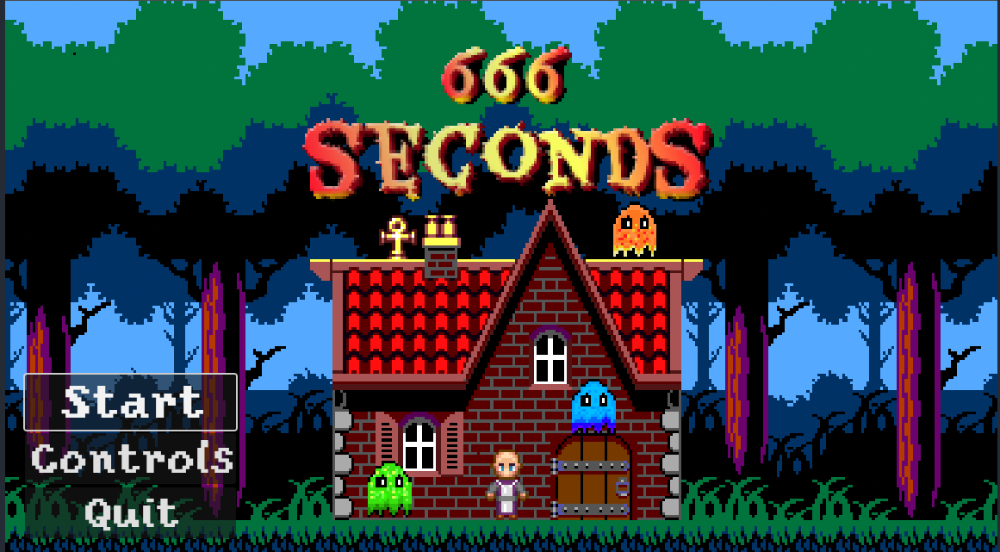
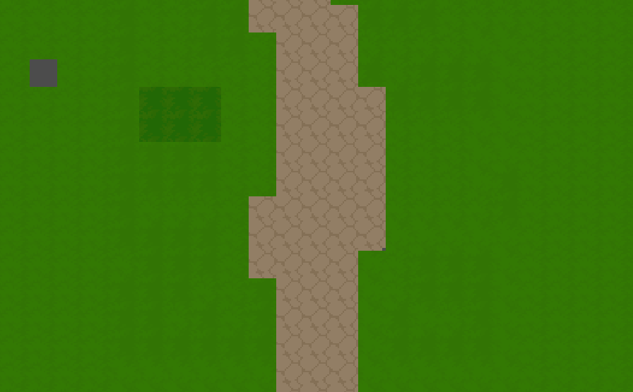
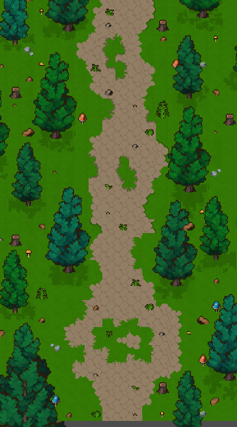
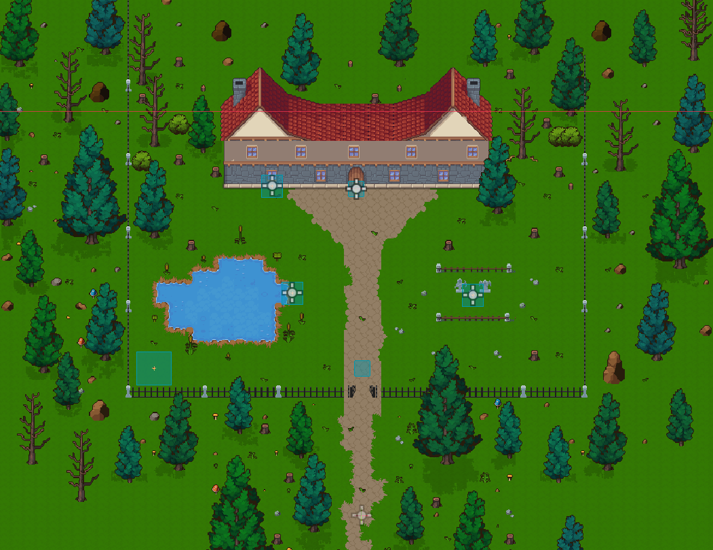
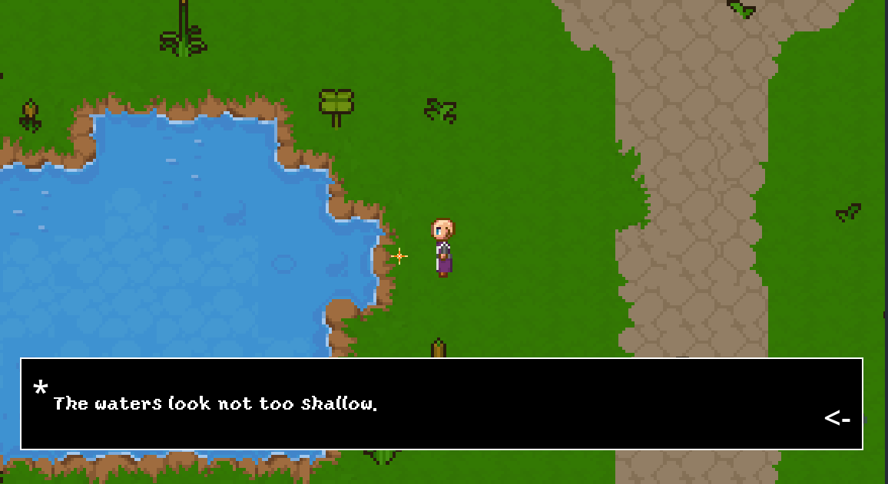
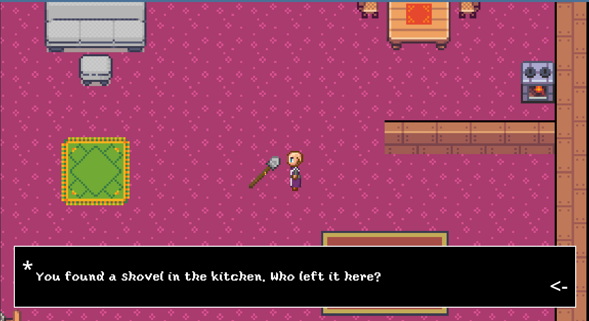

# 666-seconds

A top-down **2D pixel exploration game** developed in **Godot 4.3** as part of the course *Advanced Topics in Game Research and Engineering* at Alpen-Adria-Universität Klagenfurt.

The player explores the surroundings and interiors of **Blackwood Manor**, interacts with objects, uncovers narrative hints, and delivers items to a ghost in the basement to trigger different outcomes.

## Game Overview

* **Genre:** 2D top-down exploration
* **Engine:** Godot 4.3
* **Platform:** PC
* **Art Style:** Pixel art
* **Camera:** Top-down with smooth following
* **Team:** KlagenHaunted

  * Programming: Antonio Pirani
  * Level Design: Amin
  * Sound Design: Christian

The game is designed to be experienced at a relaxed pace, with no time limit, allowing players to focus on exploration, atmosphere, and music.

## Core Features

* Outdoor forest introduction with scripted animation
* Seamless transitions between exterior and interior areas
* Multi-floor mansion exploration
* Interactive objects with contextual text
* Central ghost character with multiple endings based on collected items
* Dynamic soundtrack switching per area

## Screenshots

### Main Menu



### Forest (Initial Area)

The player starts in a forest and is guided through a short scripted introduction sequence.



### Forest (Cleared / Not Empty)

The same forest area after interaction and progression.



### Outside Map – Blackwood Manor

The exterior of the mansion, including the gate, pond, graveyard, and surrounding fence.



### Interaction Examples

Interactive objects are marked by animated visual cues and display narrative text when activated.




## Gameplay Systems

### Movement & Controls

* **Movement:** WASD or Arrow Keys
* **Interaction:** Space, Enter, or Left Mouse Button

Movement and interaction are handled using Godot’s built-in Input Map system.

### Introduction Sequence

At the start of the game, the player character performs an automatic movement sequence:

* Walks through the forest
* Displays narrative text via a textbox system
* Approaches the mansion
* Triggers a gate-closing animation with sound

This sequence is scripted using timed movement, custom signals, and a fade transition system.

### Area Transitions

* Implemented using **Area2D** and **Marker2D** nodes
* Smooth fade-in / fade-out transition screen
* Player repositioned via scripted movement instead of teleportation
* Music changes automatically based on the active area

### Interactions System

* All interactable objects are stored under an `Interactions` node
* Each interaction uses:

  * Area2D for detection
  * CollisionShape2D for physics
  * AnimatedSprite2D for visual feedback
* Interactions display contextual flavor text
* Some objects trigger persistent state changes (e.g. disappearing items)

### Inventory & Endings

* Player items are tracked via global variables
* The ghost character checks collected items
* Different narrative outcomes are triggered based on delivered objects
* The game does not force a restart after completion, allowing continued exploration

## Audio System

* Multiple background tracks managed via a dedicated `Utils` node
* Only one soundtrack plays at a time
* Music changes automatically when entering new areas or rooms

## Project Structure

```
assets/        # External art and audio assets
scenes/        # Godot scene files
scripts/       # GDScript files
```

Version control was handled using **Git** and **GitHub Desktop**, enabling collaborative development.

## Known Limitations

* No full dialogue choice system
* Endings are determined automatically rather than through explicit player choice
* Some debug `print()` statements remain in scripts
* TileMap changes were required due to deprecation in newer Godot versions

## Requirements

* **Godot Engine 4.3** (recommended)
* Keyboard and mouse

## Credits

Developed by the **KlagenHaunted** team as an academic project.

Assets were sourced from free-to-use resources available on itch.io.

For detailed technical explanations and references, see the full project report.

## License

This project is intended for **educational purposes**. All third-party assets are subject to their respective licenses.
